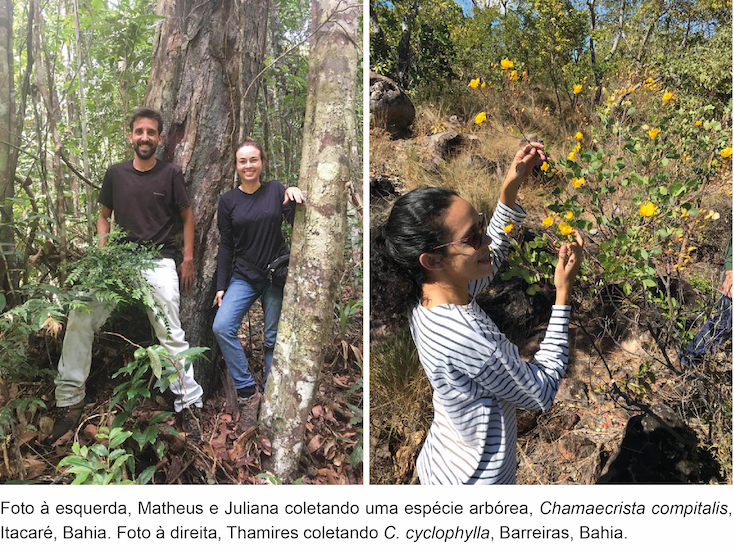

\

\

### Flora do Brasil 2020: Chave de identificação para as espécies de *Chamaecrista* Moench (Leguminosae)

Atualmente são reconhecidas 268 espécies de *Chamaecrista* com ocorrência no Brasil, é o maior centro de diversidade do gênero no mundo. *Chamaecrista* é o oitavo mais diverso gênero de angiospermas e o segundo da família Leguminosae na flora brasileira. Este site foi desenvolvido com o objetivo principal de auxiliar na identificação das espécies de *Chamaecrista* da Flora do Brasil. Em caso de problemas, erros, caracteres erroneamente codificados, favor entrar em [contato](mailto:ju.gastaldello.rando@gmail.com).

***

### Fonte dos dados

Esse site foi desenvolvido por Juliana Gastaldello Rando (UFOB), Thamires Layra Alves de Barros (UFOB) e Matheus Martins Teixeira Cota (UEFS) com dados provenientes da [Flora do Brasil](http://floradobrasil.jbrj.gov.br/)

***

#### Agradecimentos

Agradecemos ao Prof. Marcelo Reginato (UFRGS) pela elaboração do código e pelo tutorial disponibilizado que viabilizou a elaboração desta chave. O código utilizado para gerar essa página, assim como o tutorial, está disponível para [download](https://github.com/mreginato/Chave_familias_BR).

***

